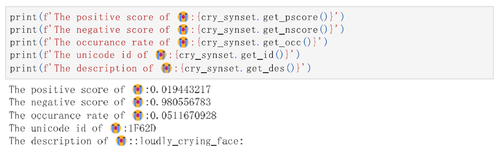
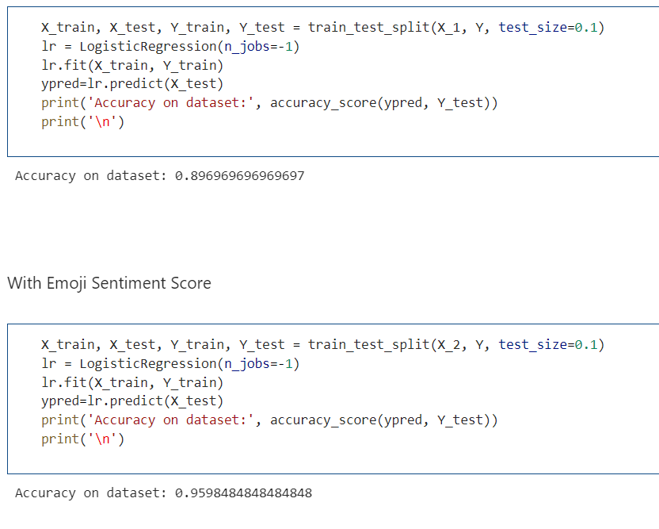

# Wordnet Extension

This project implements a custom algorithm to extend Wordnet from external resources. Currently, I only connect it to 2 senti wordnet , verbnet and expand emoji characters. This has already been applied to my sentiment analysis homework for machine learning courses. I also plan to connect it to the Framenet and this will be my future work. The main purpose is to incorporate as much information as possible into the existing wordnet. Here we try the method on corpus from "microWNOp", "SentiWordNet v3.0.0"  and "Verbnet". I also construct a emoji corpus to append emoji character to wordnet.

It was fully developed in `Python` and it is inspired by similar projects seen on `Github` .

The most important files are:

* `gen_net.py` : Generate json file for the corpus resources. Resources are saved in `wordnets`
* `sentiwordnet.py`: Extend Wordnet with Sentiwordnet and Micro Wordnet
* `verbnet.py`: Extend Wordnet with Verbnet. Enable to get verbnet class list for each available verb. The class object includes roles and frame of each verbnet class. Index can be found in [Verbnet](https://uvi.colorado.edu/class_hierarchy)
* `gen_emoji.py` : Generate statistical sentiment score for each emoji character.

* `sentiwordnet.py` : Build up a Wordnet for the emoji character. For each character


* `emoji_use.html` : emoji use on Twitter in real-time. May be block if we directly request [emojitracker](http://emojitracker.com/) so I downloaded it 


## Requirements

This project uses the following Python libraries

* `emoji` : Emoji corpus in prthon
* `advertools`: Online marketing productivity and analysis tools
* `bs4`: Python library for pulling data out of HTML and XML files
* `nltk`: The Natural Language Toolkit (NLTK)
## Wordnet-Verbnet Extension
It's an extension of WordNet API to Verbnet. Currently includes frames and roles of each verbnet classes
	```
	from nltk.corpus import wordnet as wn

	import verbnet

	encourage = wn.synset('encourage.v.02')
	#get verbnet class list for encourage.v.02
	print(encourage.vn_classes())
	#get frame list for the first class of encourage.v.02 which is accept-77
	print(encourage.vn_classes()[0].get_frames())
	#get themrole list for the first class of encourage.v.02
	print(encourage.vn_classes()[0].get_roles())
	```
## Wordnet-Senti Extension
It's an extension of WordNet API to analyze the sentiment score of WordNet 
	```

	from nltk.corpus import wordnet as wn
	
	import sentiwordnet
	
    good = wn.synset('good.a.13')
	#get score from sentiment wordnet
    print(f'sentiment score of {good.name()}: {good.senti()}')
	#get score from Micro sentiment wordnet
    print(f'micro sentiment score of {good.name()}: {good.micro_senti()}')
	```

## Emoji Extension
### Emoji Generation

scrap data from a sentiment dataset. Label each sample with the sentiment and the emoji included in it. Count score for each emoji based on its appearance in the data set. The data set currently includes 127 emoji characters. Can be more if we update more latest data.
```
python gen_emoji.py
```

### Web Scraper
Scrap the occurrence of each emoji character from "http://emojitracker.com/"

### Emoji SentiWordnet

Simulate the structure of `nltk.corpus.reader.sentiwordnet`. Can be seen as a extention of sentiwordnet.
	```

	from EmojiSentiWordnet.sentiwordnet import *
	esw=mojiSentiWordnet()
	```


### Sample use in Sentiment Analysis
File `Sample Use on Sentimental Analysis (Logistic Regression).pdf` shows a sample use of the wordnet on sentiment analysis.



##Future Work

* Connect Wordnet with Framenet
